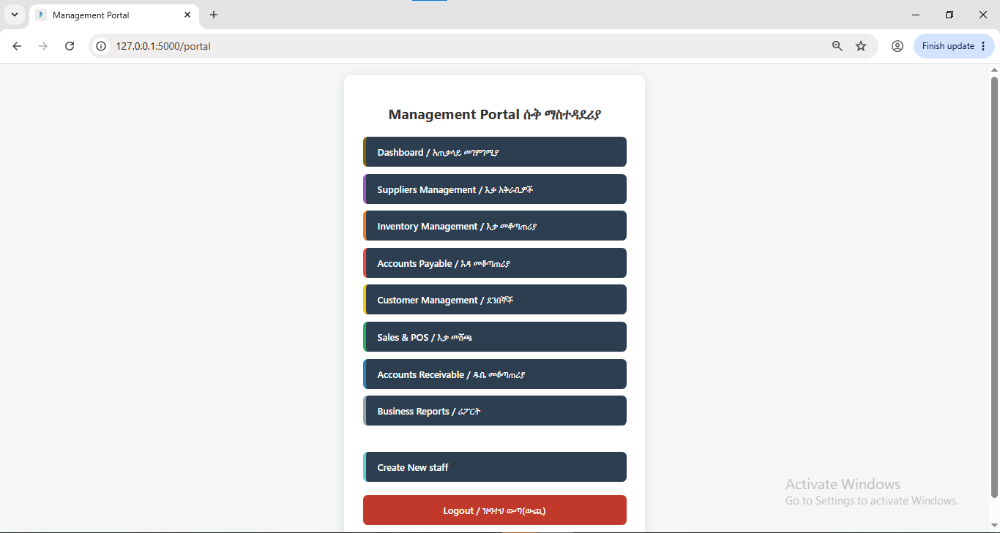
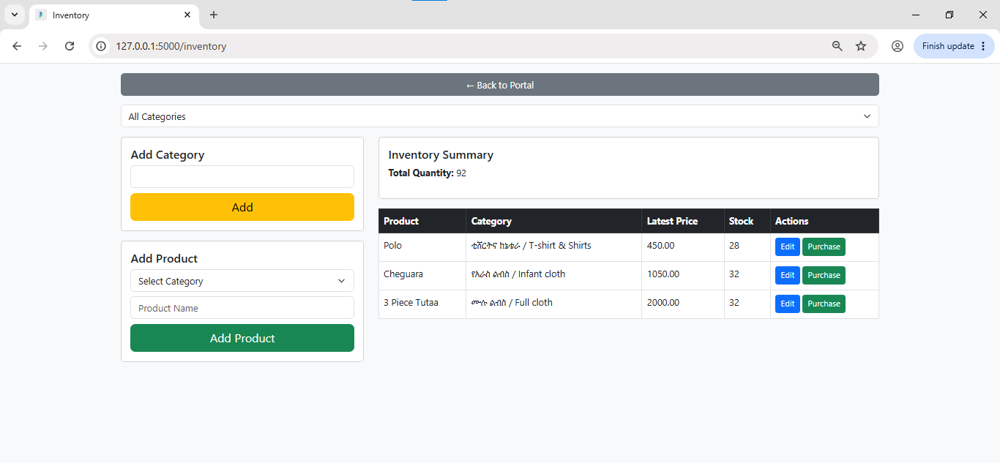
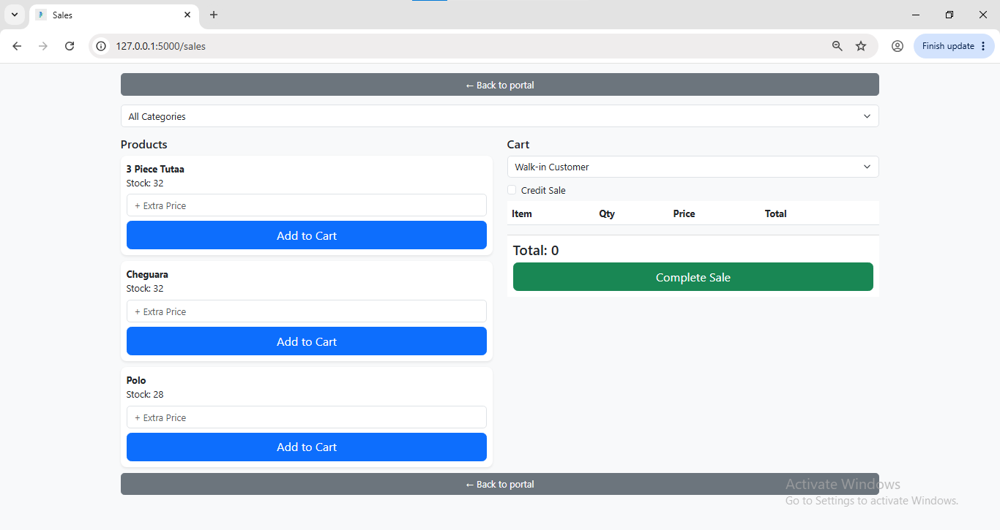
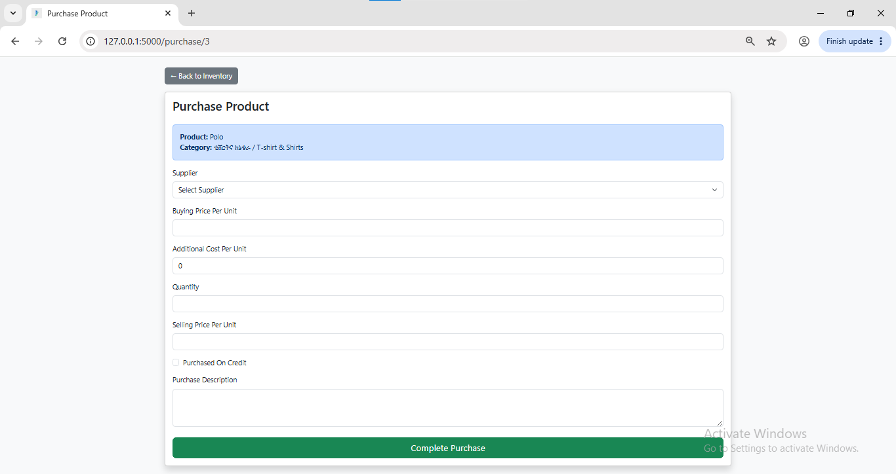
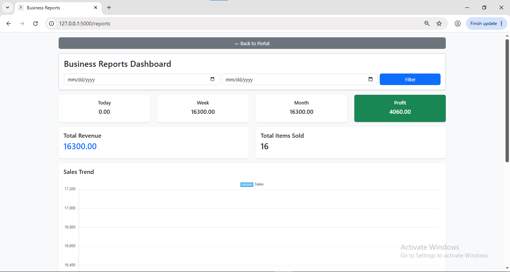

# Shop Inventory & Sales Management System

A professional Inventory, Sales, Receivable, and Payable Management System developed using Flask and MySQL for retail and Merkato-style businesses.

This system is designed to solve real-world business problems such as:

- Inventory tracking
- Dynamic pricing
- Inflation-sensitive profit calculation
- Customer debt management
- Supplier payable management
- Role-based staff access
- Sales analytics and reporting

---

# Project Overview

This project was developed as a Business Administration and Information System (BAIS) graduation project with strong focus on practical business operations and real-world retail workflows.

Unlike traditional inventory systems, this application supports:

- Historical cost-based profit calculation
- Dynamic selling price changes
- Credit sales and purchases
- Ledger-style payable & receivable tracking
- Mobile-friendly responsive interface

The project architecture was redesigned multiple times to match actual Merkato business operations and inflation-sensitive pricing environments.

---

# Technologies Used

## Backend
- Python
- Flask

## Frontend
- HTML5
- CSS3
- Bootstrap 5
- JavaScript

## Database
- MySQL

## Libraries & Tools
- Jinja2
- Werkzeug Security
- Chart.js

---

# Main Features

## Inventory Management
- Product registration
- Category management
- Stock tracking
- Dynamic selling prices
- Purchase-based inventory updates

## Purchase Management
- Supplier selection
- Buying price tracking
- Additional cost handling
- Credit purchase support
- Purchase descriptions

## Sales Management
- Cart-based sales system
- Receipt generation
- Credit sales
- Real-time stock deduction
- Historical cost tracking

## Receivable Management
- Customer debt tracking
- Partial payment recording
- Ledger-style payment history
- Remaining balance calculation

## Payable Management
- Supplier payable tracking
- Partial payment support
- Overpayment prevention
- Ledger accounting view
- Supplier dashboard

## Reporting System
- Daily sales reports
- Weekly sales reports
- Monthly sales reports
- Revenue analysis
- Net profit calculation
- Sales trend visualization
- Top-selling products

## User Authentication & Authorization
- Secure login system
- Password hashing
- Role-based access control

Roles:
- Admin
- Sales
- Purchaser

---

# Business Logic Architecture

## Inflation-Aware Pricing System

The system stores:
- Buying prices
- Extra costs
- Selling prices

inside the `purchase_items` table instead of the `products` table.

This architecture allows:
- Historical price preservation
- Accurate cost tracking
- Real business pricing behavior
- Inflation-sensitive operations

---

## Accurate Profit Calculation

To ensure profit accuracy:

- `cost_price` is stored inside `sale_items`
- Profit is calculated using historical cost at sale time

Formula:

Profit = (Selling Price - Historical Cost Price) × Quantity Sold

This prevents profit distortion when product prices change over time.

## Database Structure

Main tables include:

- users
- categories
- products
- suppliers
- customers
- purchases
- purchase_items
- sales
- sale_items
- payables
- payable_payments
- receivables
- receivable_payments

# Mobile-Friendly Design

## The system is fully responsive and optimized for:

- Desktop
- Tablets
- Smartphones

## Features include:

- Responsive tables
- Mobile cards
- Bootstrap layouts
- Clean navigation
- Ledger-style pages

# System Screenshots

## Portal



## Inventory Management



## Sales System



## Purchase



## Report Management




# Future Enhancements

- Barcode scanning integration
- Cloud deployment
- Multi-branch support
- Expense management
- Financial statement generation
- SMS/email notification system
- AI-powered sales forecasting


# Author Information
- Developed By : Michael Bahiru
- Email: michaelbahru7@gmail.com

# License

This project is developed for educational and portfolio purposes.

-------------------------


# Installation Guide

## 1. Clone Repository
- in bash
git clone https://github.com/michaelbahru/shop-inventory-sales-management-system.git

## Navigate to Project Folder and Create Virtual Environment
python -m venv venv

## Activate Virtual Environment
venv\Scripts\activate

## Install Required Packages
pip install -r requirements.txt

## Configure Environment Variables
Create a .env file in the project root directory.

## Create MySQL Database
CREATE DATABASE shop_management;

## Import Database Structure
Import the following files:

- database/schema.sql
- database/seed.sql

Using MySQL command lines:
- mysql -u root -p shop_management < database/schema.sql
- mysql -u root -p shop_management < database/seed.sql

Or import them using MySQL Workbench.

## Run the Application
```bash
python app.py
```

## Open in Browser
- Visit : http://127.0.0.1:5000

## Default Login Credentials

Update the admin credentials inside database/seed.sql before importing.
Example:
Username: admin
Password: admin123

# Project Structure

# Project Structure

```text
shop-inventory-sales-management-system/
│
├── app.py
├── db.py
├── requirements.txt
├── .env.example
├── README.md
│
├── database/
│   ├── schema.sql
│   ├── seed.sql
│   └── README.md
│
├── static/
├── templates/
├── routes/
├── models/
└── utils/
```

# Key Highlights

- Real-world Merkato business workflow simulation
- Inflation-aware inventory pricing architecture
- Historical profit calculation system
- Ledger-style receivable and payable tracking
- Role-based authentication and authorization
- Responsive Bootstrap-based interface

## Acknowledgment

This project was developed as part of a BAIS graduation project with strong emphasis on solving practical retail business management challenges.